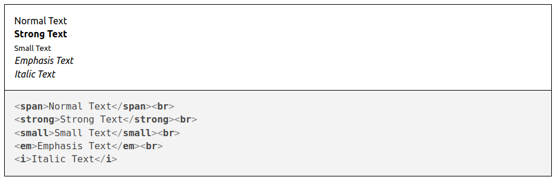
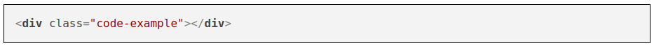
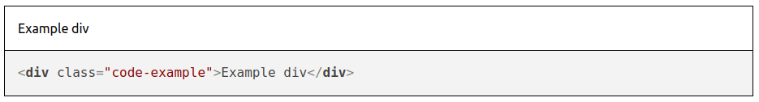
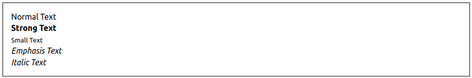
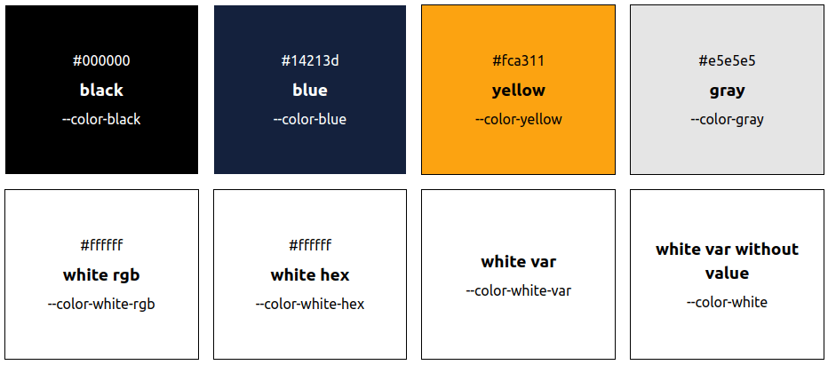
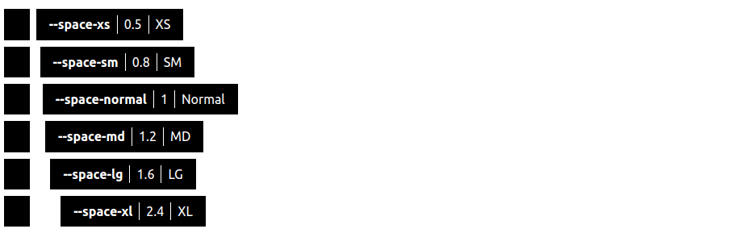
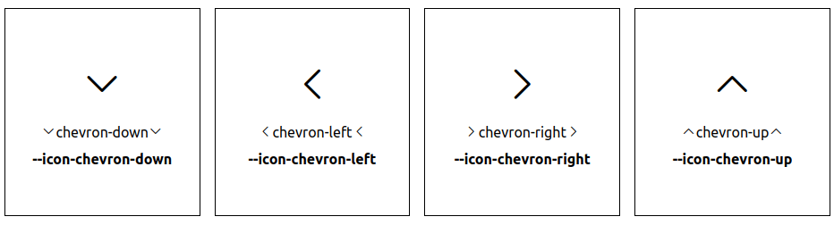

# @ui-doc/core

The core parsing and rendering engine for UI-Doc. This package extracts documentation from JSDoc-style comment blocks in your source files and transforms them into structured context for rendering.

## Overview

UI-Doc Core performs the following steps:

1. **Parse** - Extract comment blocks from source text (CSS, JS, TS)
2. **Transform** - Convert blocks into structured UI-Doc context using tag transformers
3. **Render** - Output the context using a renderer implementation

## Quick Start

```js
import fs from 'node:fs/promises'
import path from 'node:path'
import { UIDoc } from '@ui-doc/core'

// Create a renderer instance (depends on your chosen renderer)
// const renderer = ...

const outputDir = './dist'
const filePath = path.resolve('./my-css-file-to-source.css')

// Create a UI-Doc instance
const uidoc = new UIDoc({
  renderer,
  // ... other options
})

// Read the file content
const content = await fs.readFile(filePath, 'utf8')

// Create a new source
uidoc.sourceCreate(filePath, content)

// Output all files
await uidoc.output(async (fileName, content) => {
  await fs.writeFile(`${outputDir}/${fileName}`, content, 'utf8')
})
```

## Documentation Syntax

Documentation blocks use JSDoc-style syntax with special tags for UI-Doc:

```js
/**
 * Will be interpreted as a page.
 *
 * @page typography Typography
 */

/**
 * Will be interpreted as a section on the page `typography`.
 * Gives an example of default typography formats.
 *
 * @location typography.format Format
 * @example
 * <span>Normal Text</span><br>
 * <strong>Strong Text</strong><br>
 * <small>Small Text</small><br>
 * <em>Emphasis Text</em><br>
 * <i>Italic Text</i>
 */
```

Tags follow this syntax: `@tag-name[ {type}][ name][ description]`

## Available Tags

Tags are separated into two roles:

- **Placement** - Where in the documentation your block appears (at least one required)
- **Display** - What content is shown and how it's displayed

| Tag       | Role      | Description                                   |
| --------- | --------- | --------------------------------------------- |
| @code     | display   | Specify code that will be displayed           |
| @example  | display   | Add example with live preview and code        |
| @hideCode | display   | Remove code from block (show only preview)    |
| @location | placement | Combine `@page` and `@section` in one tag     |
| @order    | placement | Define sorting order for pages/sections       |
| @page     | placement | Create or reference a page                    |
| @section  | placement | Create or reference a section                 |
| @color    | display   | Define a color variable used in your styles   |
| @space    | display   | Define a spacing variable used in your styles |
| @icon     | display   | Define an icon from your icon font            |

You can combine tags to achieve different outcomes. See individual tag documentation for details.

## Tag Reference

### @example

Displays both a live preview and the code. The preview shows how your component looks, while the code is displayed as a copyable block.

```js
/**
 * Will display code and example
 *
 * @example
 * <span>Normal Text</span><br>
 * <strong>Strong Text</strong><br>
 * <small>Small Text</small><br>
 * <em>Emphasis Text</em><br>
 * <i>Italic Text</i>
 */
```



### @code

Displays only the code block without a live preview.

```js
/**
 * Will display code.
 *
 * @code
 * <div class="code-example"></div>
 */
```



When used with `@example`, the code from `@code` overrides the example code. This is useful for hiding inline styling or extra HTML needed for display:

```js
/**
 * The example includes inline styles for better display,
 * but the code shows the clean version.
 *
 * @example
 * <div class="code-example" style="max-width: 200px"></div>
 *
 * @code
 * <div class="code-example"></div>
 */
```



### @hideCode

Hides the code block when you only want to show a visual example.

```js
/**
 * Only show visual examples of different typography.
 *
 * @example
 * <span>Normal Text</span><br>
 * <strong>Strong Text</strong><br>
 * <small>Small Text</small><br>
 * <em>Emphasis Text</em><br>
 * <i>Italic Text</i>
 * @hideCode
 */
```



### @page

Creates a page or references the page where your block should appear.

```js
/**
 * Creates a `Typography` page with the key `typo`.
 * The key can be used for reference in other blocks.
 *
 * @page typo Typography
 */

/**
 * Displays the section `sizes` on the page with key `typo`.
 *
 * @page typo
 * @section sizes Different Font Sizes
 */

/**
 * Same as above using @location shorthand.
 *
 * @location typo.sizes Different Font Sizes
 */
```

### @section

Creates a documentation section within a page.

```js
/**
 * Display the section `sizes` on the page with key `typo`.
 *
 * @page typo
 * @section sizes Different Font Sizes
 */

/**
 * You can nest sections using dot notation.
 * This displays section `small` inside section `sizes` on page `typo`.
 *
 * @page typo
 * @section sizes.small A small typography variation
 */
```

### @location

A shorthand combining `@page` and `@section` in one tag.

```js
/**
 * Display the section `sizes` on the page with key `typo`.
 *
 * @location typo.sizes Different Font Sizes
 */

/**
 * You can nest sections using dot notation.
 * This displays section `small` inside section `sizes` on page `typo`.
 *
 * @location typo.sizes.small A small typography variation
 */
```

### @order

Defines the display order for pages or sections using a number. When order values are equal, alphabetical sorting is used.

```js
/**
 * @page bar Bar
 * @order 2
 */

/**
 * @page foo Foo
 * @order 1
 */

// Display order will be: Foo | Bar

/**
 * @location test.bar Bar
 * @order 2
 */

/**
 * @location test.foo Foo
 * @order 1
 */

// Display order will be: Foo | Bar (same as above)
```

### @color

Defines colors used in your styles. Multiple colors can be defined in one block and will be displayed together.

```js
/**
 * The colors used in this style.
 *
 * @color {0 0 0|255 255 255} --color-black | black
 * @color {20 33 61|255 255 255} --color-blue | blue
 * @color {252 163 17} --color-yellow | yellow
 * @color {229 229 229} --color-gray | gray
 * @color {255 255 255} --color-white-rgb - white rgb
 * @color {#fff} --color-white-hex white hex
 * @color {--color-white} --color-white-var white var
 * @color --color-white white var without value
 */
```



**Syntax:**

- **Type** (in braces): RGB value (e.g., `0 0 0`) or hex value (e.g., `#fff`)
  - Optional: Include a second RGB value separated by `|` to specify the text color
- **Name**: Variable name (e.g., `--color-black`)
- **Description**: Human-readable name, separated by `|`, `-`, or whitespace

If you provide a custom stylesheet with CSS custom properties, you can reference them directly:

```css
:root {
  --color-white: 255 255 255;
}
```

### @space

Defines spacing values used in your layout. Multiple spaces can be defined in one block.

```js
/**
 * The space definitions.
 *
 * @space {0.5} --space-xs | XS
 * @space {0.8} --space-sm | SM
 * @space {1} --space-normal | Normal
 * @space {1.2} --space-md | MD
 * @space {1.6} --space-lg - LG
 * @space {2.4} --space-xl XL
 */
```



**Syntax:**

- **Type** (in braces): Spacing value (e.g., `0.5`, `1.2`)
- **Name**: Variable name (e.g., `--space-xs`)
- **Description**: Human-readable name, separated by `|`, `-`, or whitespace

The spacing value is used when rendering the visualization. With the default renderer, this value is multiplied by the spacing unit.

### @icon

Defines icons from your icon font. Multiple icons can be defined in one block.

```js
/**
 * Some icons used.
 *
 * @icon {e900} --icon-chevron-down - chevron-down
 * @icon {e901} --icon-chevron-left - chevron-left
 * @icon {--icon-chevron-right} --icon-chevron-right | chevron-right
 * @icon --icon-chevron-up | chevron-up
 */
```



**Syntax:**

- **Type** (in braces): Character code (e.g., `e900`) or CSS variable reference
- **Name**: Variable name (e.g., `--icon-chevron-down`)
- **Description**: Human-readable name, separated by `|`, `-`, or whitespace

**Requirements:**

You must provide a custom stylesheet defining the `@font-face` for your icon font and set the `--icons-font-family` variable:

```css
@font-face {
  font-family: icons;
  font-weight: normal;
  font-style: normal;
  font-display: block;
  src: url('fonts/icons.eot');
  src:
    url('fonts/icons.eot#iefix') format('embedded-opentype'),
    url('fonts/icons.ttf') format('truetype'),
    url('fonts/icons.woff') format('woff'),
    url('fonts/icons.svg#icons') format('svg');
}

:root {
  --icons-font-family: icons;
}
```

## Integration

UI-Doc can be integrated into any build process. Official integrations are available for:

- [Rollup](../rollup/README.md)
- [Vite](../vite/README.md)

You can also write a custom integration or use it in a Node.js script (see Quick Start above).

## API Reference

### UIDoc Options

| Name        | Required | Type                | Description                                                    |
| ----------- | -------- | ------------------- | -------------------------------------------------------------- |
| renderer    | yes      | Renderer            | The renderer that generates output from the context            |
| blockParser | no       | BlockParser         | Custom parser implementation for extracting and parsing blocks |
| generate    | no       | object of functions | Functions that generate content for the renderer               |
| texts       | no       | object of texts     | Text strings used by the default generate functions            |

### Texts Options

| Name      | Description                                          |
| --------- | ---------------------------------------------------- |
| copyright | Used in footer text to display copyright information |
| title     | Title of your UI-Doc site                            |

### Generate Functions

Functions that control how various parts of the documentation are generated:

| Name         | Return Type                                                    | Parameters                   | Description                              |
| ------------ | -------------------------------------------------------------- | ---------------------------- | ---------------------------------------- |
| exampleTitle | string                                                         | ExampleContext               | Create page title for examples           |
| footerText   | string                                                         | -                            | Text for the footer                      |
| homeLink     | string                                                         | -                            | Link to the homepage (front page)        |
| logo         | string                                                         | -                            | Logo to display (text, HTML, or SVG)     |
| menu         | {active: boolean, href: string, order: number, text: string}[] | menu array, pages array      | Create or manipulate the navigation menu |
| name         | string                                                         | -                            | Name of your UI-Doc site                 |
| pageLink     | string                                                         | page context                 | Link to a page                           |
| pageTitle    | string                                                         | page context                 | Title of a page                          |
| resolve      | string                                                         | uri: string, context: string | Transform or manipulate a URI            |

You can customize generate functions in two ways:

```ts
// Set via options
const uidoc = new UIDoc({
  generate: {
    footerText: () => 'Custom Footer Text',
  },
})

// Using the replaceGenerate method
uidoc.replaceGenerate('name', () => 'MyUIDoc')
```

## Events

UI-Doc provides an event system for customization.

| Name          | Parameters        | When                                                   |
| ------------- | ----------------- | ------------------------------------------------------ |
| context-entry | ContextEntryEvent | Before a context entry is created, updated, or deleted |
| example       | ExampleEvent      | Before an example is output                            |
| output        | OutputEvent       | Before the complete documentation is output            |
| page          | PageEvent         | Before a page is output                                |
| source        | SourceEvent       | Before a source is created, updated, or deleted        |

**Example:**

```ts
// Change the order on every entry to 200
function onContextEntry({ entry }) {
  entry.order = 200
}

// Register your listener
uidoc.on('context-entry', onContextEntry)

// Unregister your listener
uidoc.off('context-entry', onContextEntry)
```

## CommentBlockParser

The default `CommentBlockParser` extracts comment blocks from source code using JSDoc-style comments.

```js
/**
 * Will be interpreted as a page.
 *
 * @page typography Typography
 */

/**
 * Will be interpreted as a section on the page `typography`.
 * Gives an example of default typography formats.
 *
 * @location typography.format Format
 * @example
 * <span>Normal Text</span><br>
 * <strong>Strong Text</strong><br>
 * <small>Small Text</small><br>
 * <em>Emphasis Text</em><br>
 * <i>Italic Text</i>
 */
```

By default, `CommentBlockParser` uses `MarkdownDescriptionParser` to parse markdown in descriptions to HTML.

### CommentBlockParser Events

| Name   | Parameters | When                    |
| ------ | ---------- | ----------------------- |
| parsed | Block      | After a block is parsed |

### Custom Tags

You can register custom tag transformers to extend UI-Doc's functionality. Here's an example of creating an `@author` tag:

```ts
// Usage: @author author-key Author Name

import { CommentBlockParser, createMarkdownDescriptionParser } from '@ui-doc/core'

const commentBlockParser = new CommentBlockParser(createMarkdownDescriptionParser())

commentBlockParser.registerTagTransformer({
  name: 'author', // name of your tag
  transform(block, spec) {
    // Add the author to the block being transformed
    // spec contains the parsed information from your tag
    block.author = {
      key: spec.name, // author-key
      name: spec.description, // Author Name
    }
  },
})
```

The `transform` function receives:

- `block` - The block object being transformed
- `spec` - The parsed tag specification containing:
  - `name` - The name portion of the tag
  - `description` - The description portion of the tag
  - `type` - The type portion (in braces)

## License

See [LICENSE.md](../../LICENSE.md) for license information.
